# Cascadia_2013

## 2013 Cascadia Proteomics Symposium talk

### Institute for Systems Biology, Seattle, WA

### July 15-16, 2013

---

Wilmarth_Cascadia_Extending_Parsimony.ppt - Powerpoint of talk with notes

---

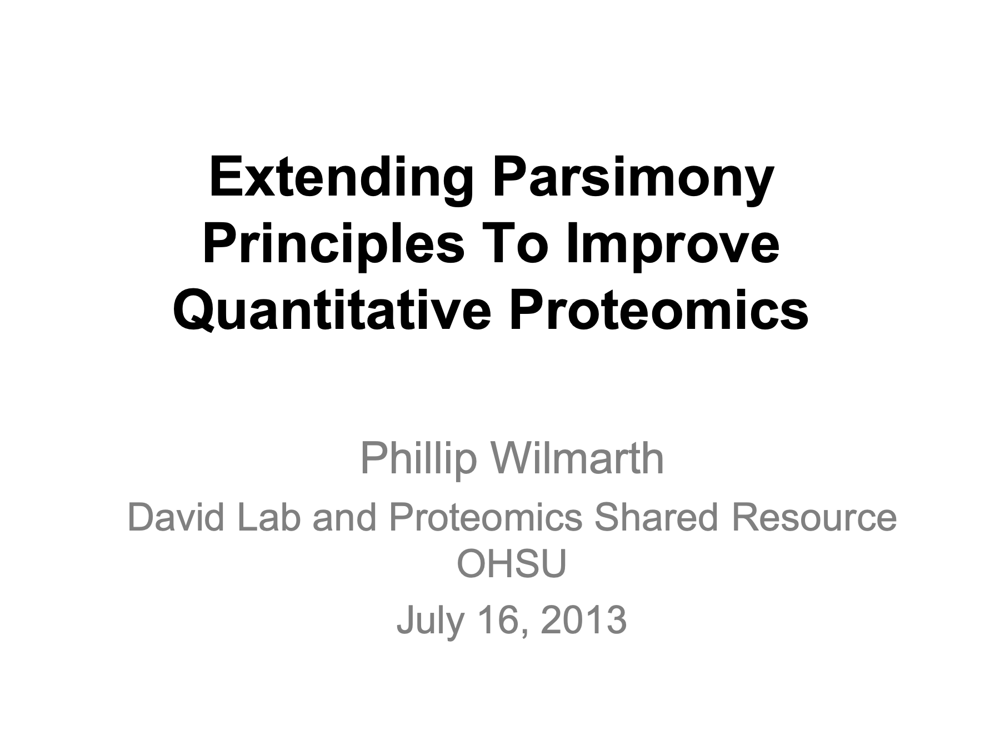

I would like to thank the organizers for this opportunity to tell you about some work I have done at OHSU.

---

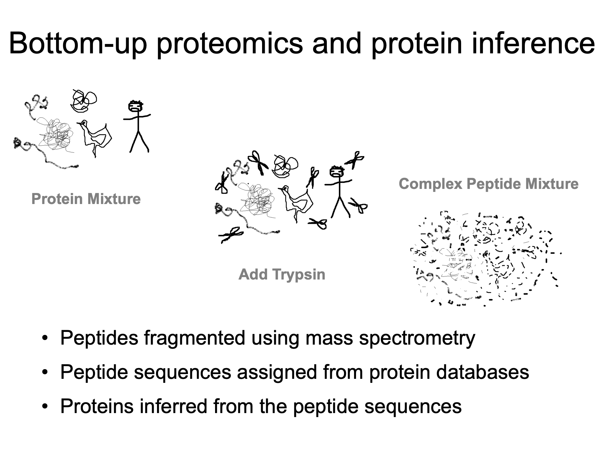

We most often use bottom-up proteomics, and this leads to the protein inference problem. We have difficulty working with intact proteins, so we add trypsin and digest the proteins into peptides. Peptides are more stable, more soluble, and are better suited for mass spectrometers. After chromatographic separations of the complex peptide mixtures, we use mass spectrometry to fragment the peptides into smaller pieces and measure their masses. Software like SEQUEST or Mascot use protein sequence databases to assign peptide sequences to the fragment ion data. Biologists are not usually interested in peptides, so we have to infer which proteins were originally present in the sample from the identified peptide sequences.

---

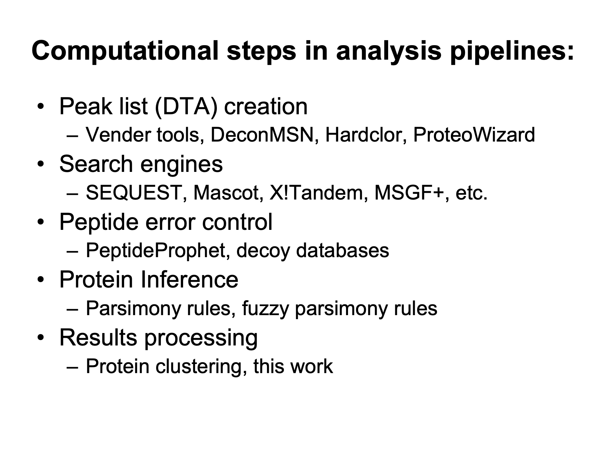

Let’s look at the typical analysis steps in bottom-up proteomic experiments and see where some computational algorithms are used. Getting the MS2 peak lists from the vendor instrument files requires computational software. Search engines are the major players in computational proteomics and there are many to choose from. Search engines are too good at assigning sequences, so we have to separate good peptide matches from bad ones. Peptide Prophet was pioneering work on statistical analysis of global score distributions. Decoy databases are not conceptually so different. They just use an empirical incorrect score distribution. Next, we have the protein inference problem. Simple peptide-to-protein mapping is too noisy due to peptide ambiguity, so the proteomics community adopted parsimony rules for protein reporting. I consider algorithms such as Protein Prophet or FIDO to be fuzzy parsimony filters. However, biologists need to compare proteomes between samples or compare protein expression between samples. Additional processing of results are often needed to do that. Protein clustering as implemented in Scaffold is one example. I prefer the terminology **protein family grouping** and that is what I will tell you about today.

---

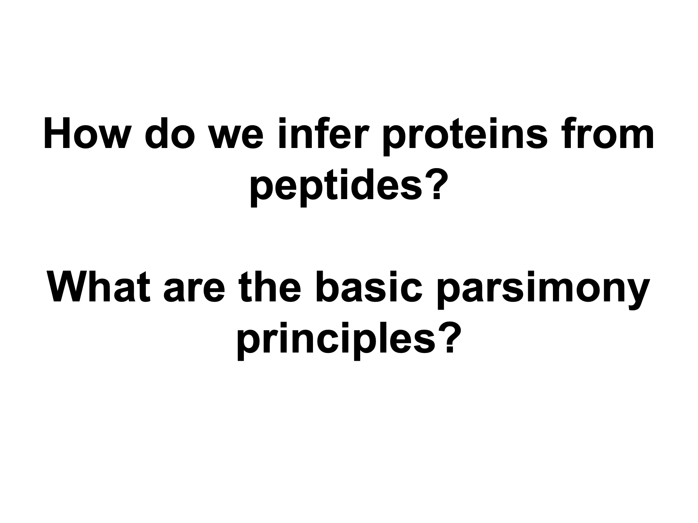

To understand why we might need to extend parsimony principles and do additional results processing, we need to review how we infer protein sequences from peptide sequences and just what are the basic parsimony rules.

---

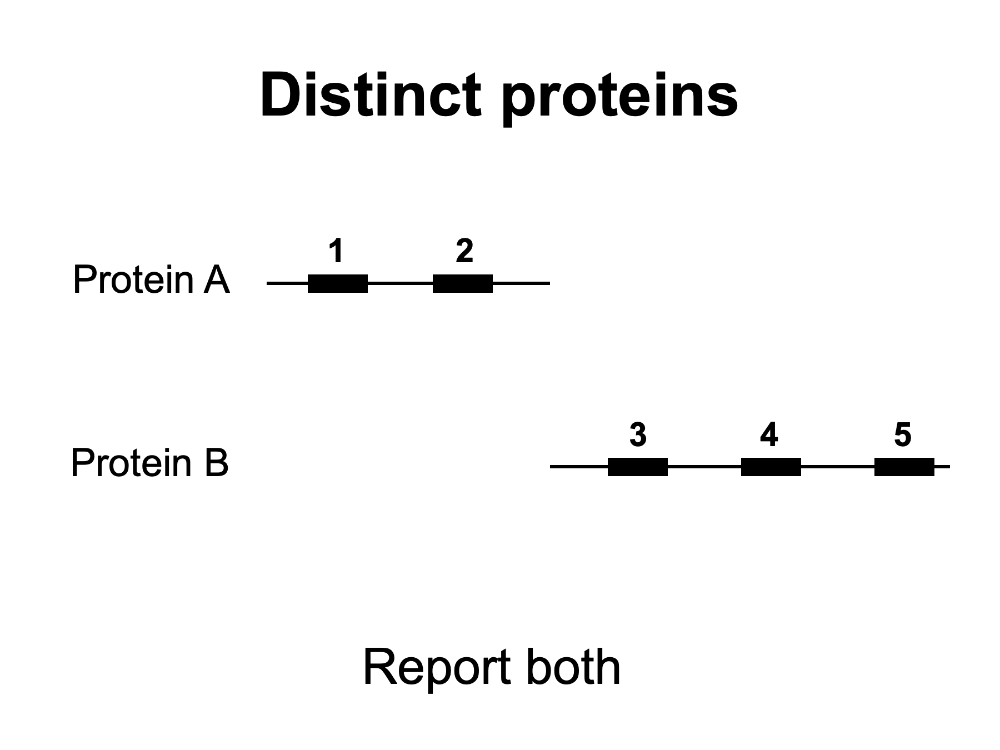

Let’s look at some examples. The whole process starts with mapping the peptide sequences back to protein sequences in the database, and keeping track of all of the proteins that they match to. Here we have a simple case where peptides 1 and 2 match only to Protein A. We have three different peptides that match only to Protein B. Protein inference is trivial and we report both proteins as being present in our sample.

---

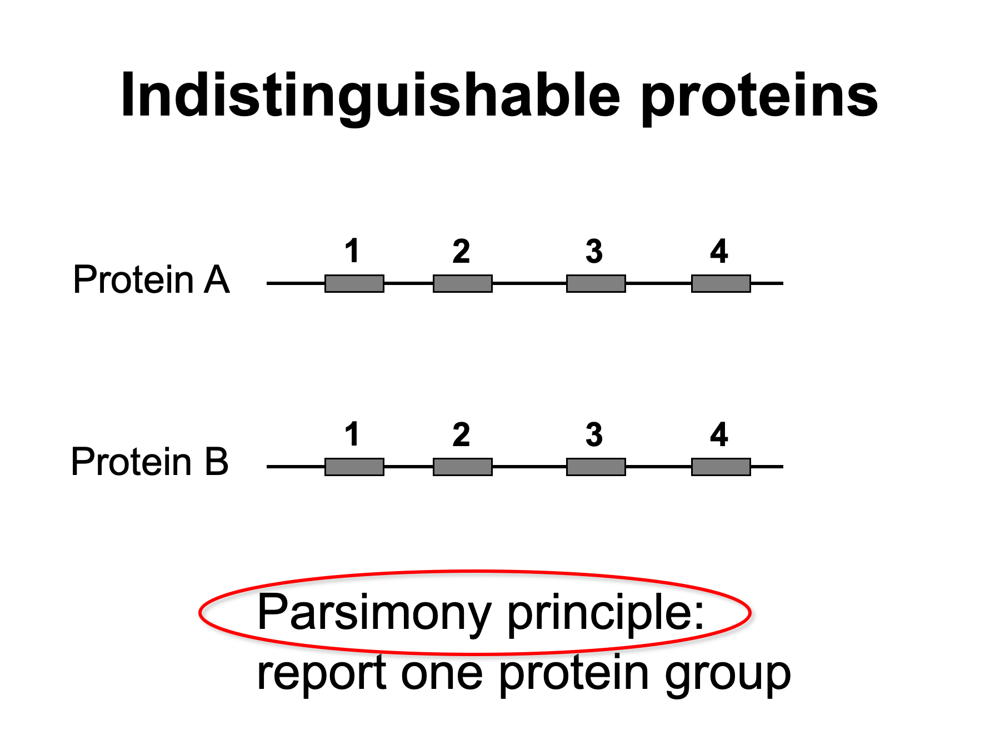

In this case, we have 4 peptides and all of them are shared between Proteins A and B. There are no unique peptides. We can’t say if Protein A is present in the sample, or if Protein B is present, or if both are present. We report one protein **group** having two redundant proteins.

---

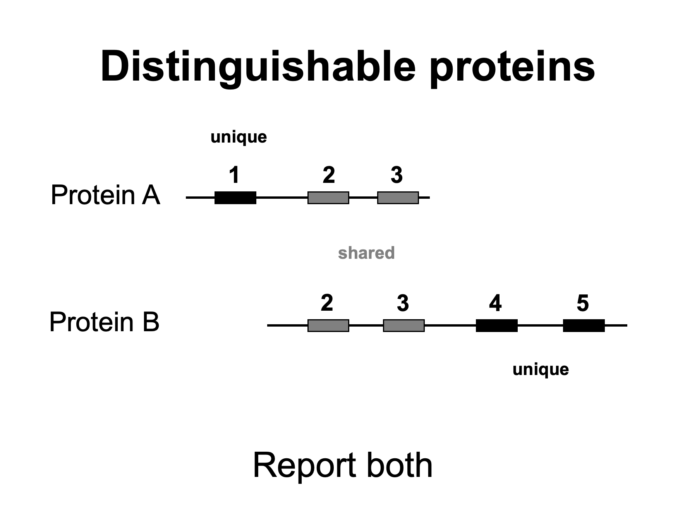

Here is a little more complicated case. Peptide 1 matches only to Protein A and peptides 4 and 5 match only to Protein B. We call these **unique** peptides. Peptides 2 and 3 match to both Protein A and Protein B. We call these **shared** peptides and they can complicate things. In this case, we can still distinguish Protein A from Protein B based on the unique peptides and we would report both proteins.

---

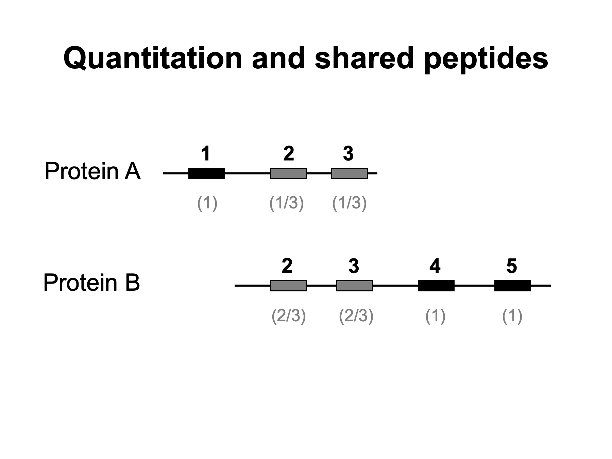

Shared peptides also complicate quantitative studies. There are quantitative techniques such as iTRAQ or SILAC that have been developed for bottom up proteomics studies, and they provide information on a per peptide basis. We usually want **protein** expression not **peptide** expression. The information from unique peptides can be directly related to parent protein expression. It is more complicated for shared peptides because their quantitative information is a mixture of parent protein expression levels. Should we include, exclude, or try to un-mix shared peptide information? We frequently use spectral counting quantification in our core. The total number of peptide matches, the spectral count, of a protein has been shown to be highly correlated with protein abundance. It is very simple, we just count up peptide matches. Protein A has 3 peptide matches and protein B has 4 peptide matches. However, this gives a grand total of 7 matches instead of 5 because we have over-counted the shared peptides. If we exclude the shared peptides, we would have one match to protein A, two matches to protein B, and a grand total of only 3 counts. Alternatively, we could split the shared peptides based on the relative unique peptides. Proteins A has one of the three unique peptides and B has two of the three unique peptides. We would then estimate that protein A has 1.67 counts and protein B would have 3.33 counts. Then the grand total would be 5. The important point is that shared peptides have implications for both protein inference and protein quantification.

---

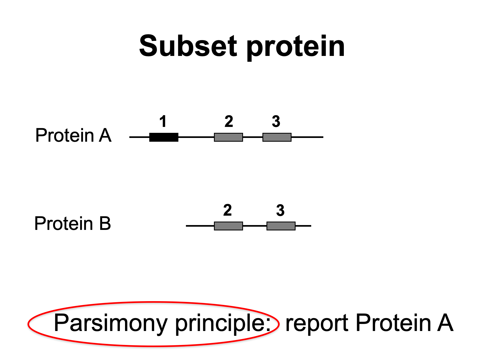

Back to the examples. Here we have three peptides matched to Protein A, one is unique and two are shared with Protein B. There are no unique peptides for Protein B. The presence of Protein A in the sample can explain all of the observed peptides. There is no direct evidence that Protein B is present (it might be). The parsimony principle is to report the smallest number of proteins that can explain all of the observed peptides. Therefore, we would report only Protein A.

---

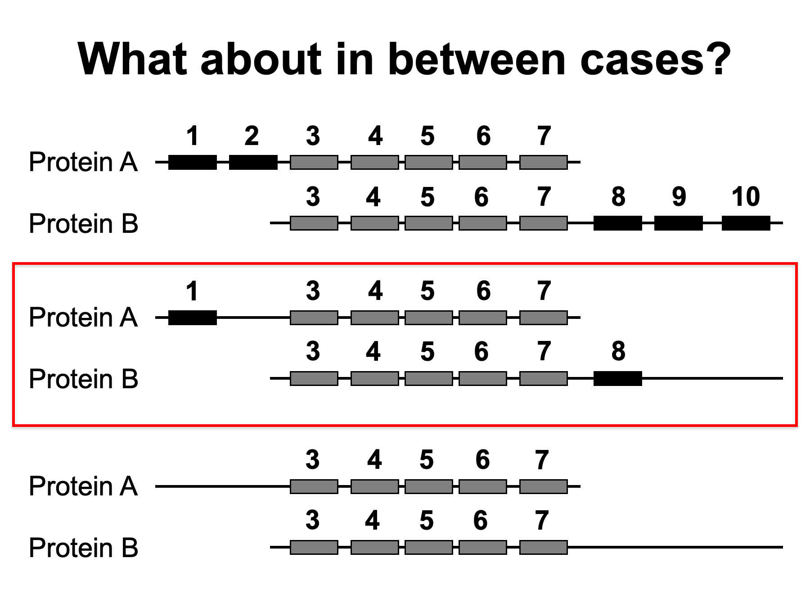

On the top we have two distinguishable proteins with non-identical peptide sets so we would infer two proteins. On the bottom we have two redundant proteins having identical peptide sets so we report one redundant group. What about the case in the middle? When do we have sufficient unique peptide evidence to distinguish two proteins? What if the number of shared peptides were 10 times larger? Would the unique evidence be as convincing? Current instruments can sequence millions of peptides in a single experiment. Our peptide sequence assignments are not error free. We do have some number of incorrect peptide sequences. What if peptide 1 or peptide 8 (or both) was incorrect and was removed? Incorrect peptide matches can interfere with redundant and subset grouping. The basic parsimony principles consider all peptide sequences to be correct. The basic parsimony rules are pretty clear for simple, pair-wise cases; however, there are also many non-simple cases.

---

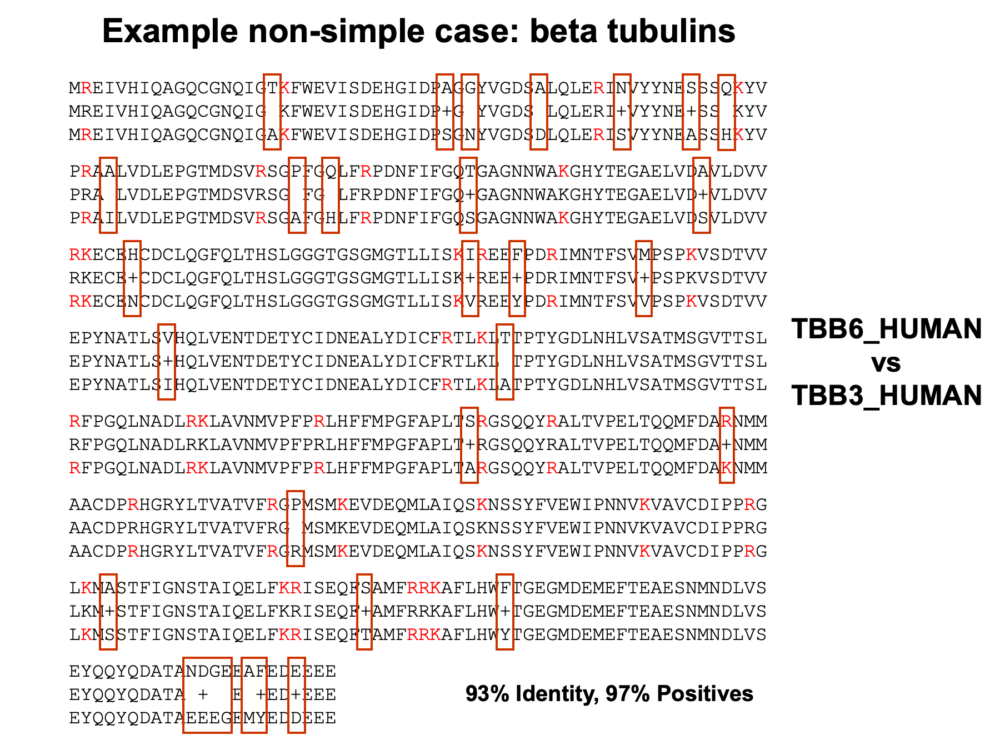

Here is one example of a non-simple case: beta tubulins. There are many beta tubulin genes in human and they all have significant sequence homology with each other. Here is the alignment of one pair of the over half dozen beta tubulins in human Sprot. Many of the tryptic peptides from these two proteins would be identical. Our ability to distinguish beta tubulins would depend on high sequence coverage (we have to detect distinguishable peptides) and whether or not there really are any distinguishable peptides (this is just two tubulin sequences from a larger family of very similar beta tubulins). It is important to note that we are not just doing single pair-wise comparisons in these non-simple cases.

---

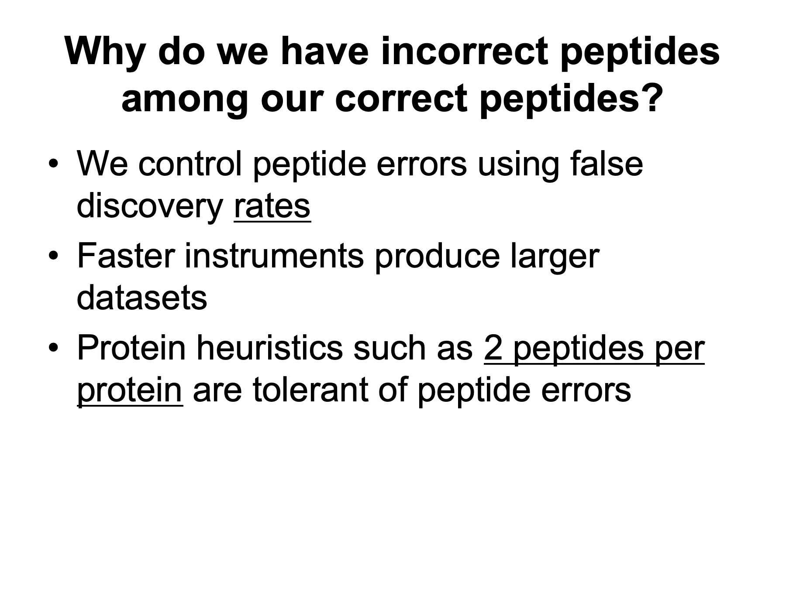

Incorrect peptide sequences obviously complicate an already complicated problems, so why do we allow them? When using false-discovery rate approaches, we do not exclude all incorrect peptide matches, we just estimate what proportion they are of the total. Somehow 1% peptide FDRs seem to work in practice. Since we are controlling error at a fixed rate, the number of incorrect peptides depends on the dataset size. Newer, faster instruments produce much larger datasets, so the number of incorrect peptides passed through at 1% FDR has grown. Despite all of our sophisticated peptide filtering methods, we usually rely on one simple protein ID heuristic, namely, proteins have to have at least two distinct peptides.  

---

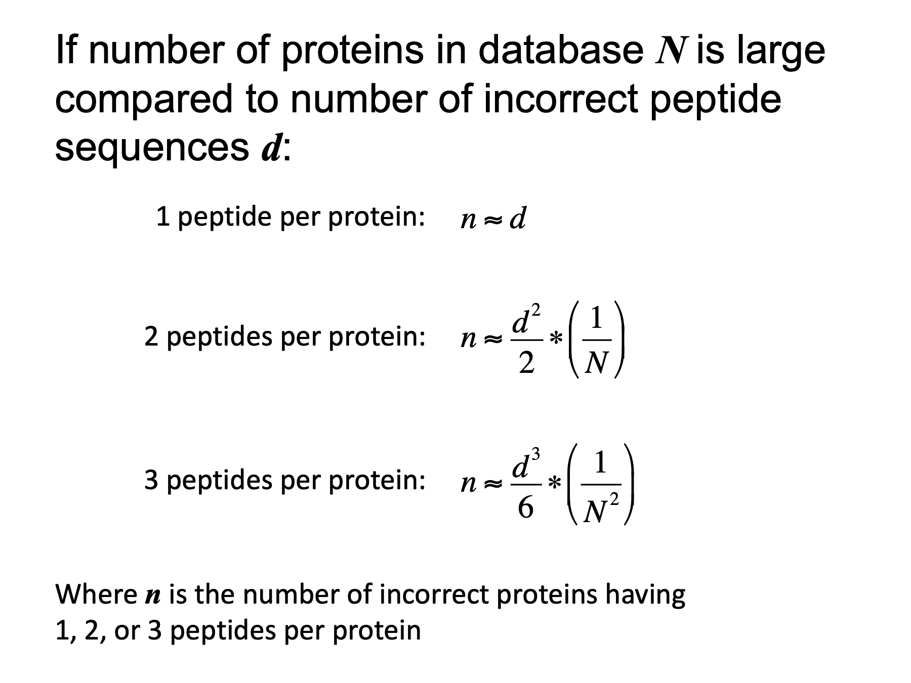

The 2 peptides per protein rule is so commonly used because it is a powerful noise filter. I do not have time to derive these approximate expressions for the number of incorrect proteins as a function of the number of incorrect peptide sequences. However, there are a couple of important points to note. (1) the left sides of these equations is the **number of incorrect proteins**, n. It is not a protein false discovery rate. (2) The variables on the right are the **number of incorrect peptide sequences**, d, and the total number of proteins in the database, N. Again, d is not a rate. The first equation is why we do not usually consider “one hit wonders”. Every incorrect peptide produces an incorrect protein. For the second or third line, if the number of incorrect peptides is small compared to the number of proteins in the database, the number of incorrect proteins (n) will be much smaller than the number of incorrect peptide sequences (d). Consider a human sample where there were 200 incorrect peptide sequences and a protein database of 20,000. The estimate would be 1 incorrect protein. That is over 2 orders of magnitude noise reduction. Two peptides per protein strikes the best compromise between sensitivity and noise reduction for current dataset and database sizes. Data repositories might want to consider 3 or even 4 peptides per protein to prevent accumulating noise.

---

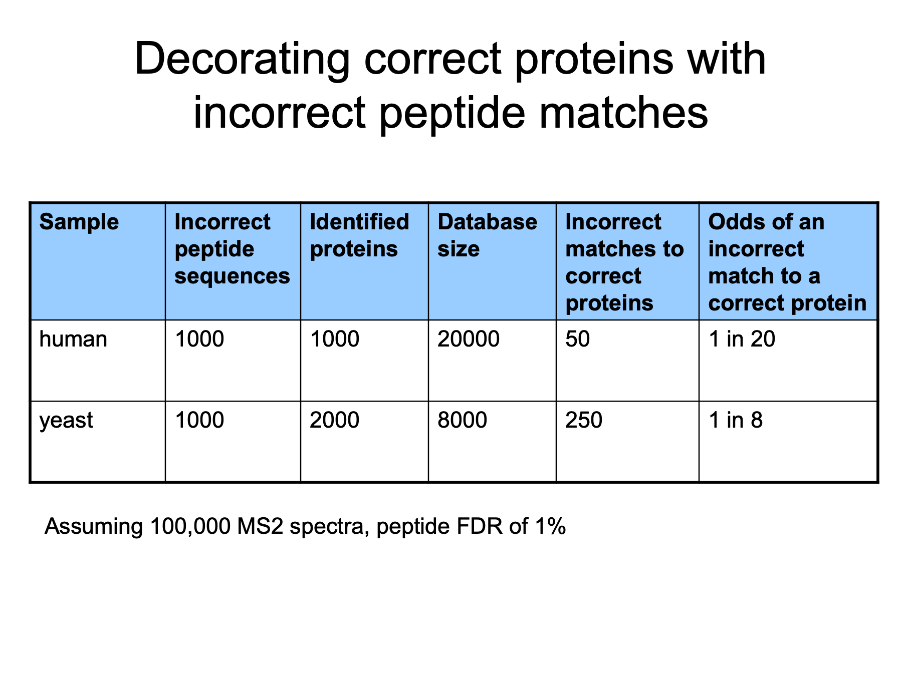

You might wonder if incorrect peptide matches are really a problem for parsimony rules. They are. Here are some hypothetical numbers for a human sample and a yeast sample. I assumed a 100,000 spectra, a 1% peptide FDR, and some ballpark numbers for identified proteins. We see that the chance for incorrect matches to correct proteins are actually quite large.

---

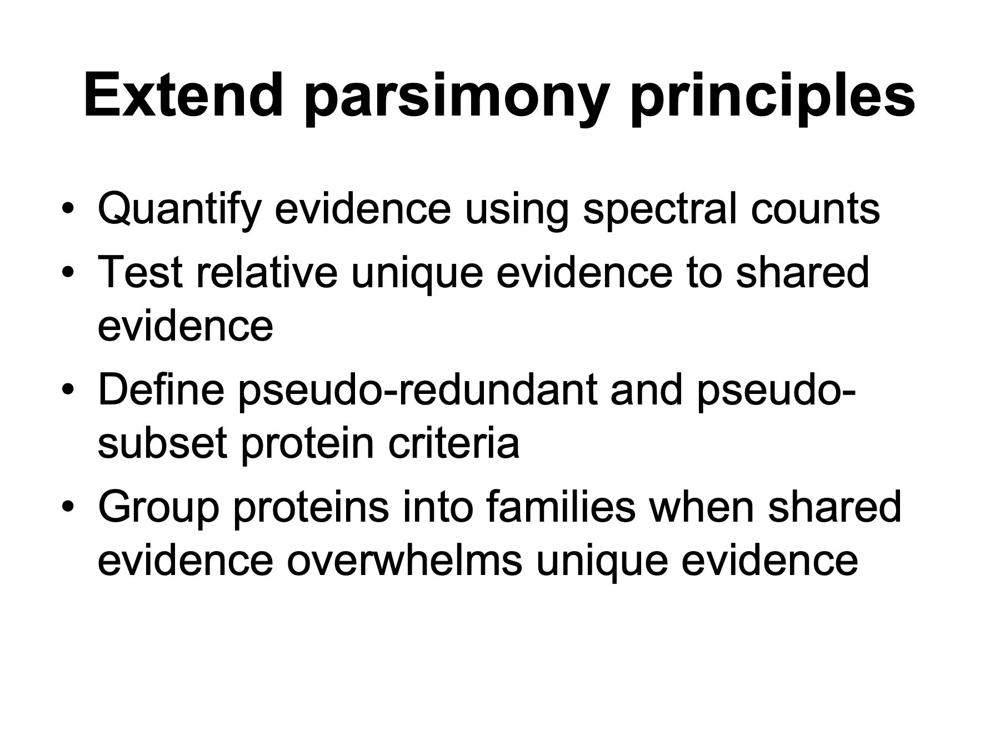

To handle peptide noise and complicated protein families, we need to extend parsimony principles to explicitly handle situations where we have larger numbers of shared peptides and smaller number of unique peptides (the middle case from a few slides ago). The basic idea is to **quantify the unique peptide evidence** and to **quantify the shared peptide evidence**, and then test their **relative weights**. We can easily determine unique and shared peptide sets when comparing two proteins using simple set operations. We use the sets of peptides to compute the total unique peptide counts for each protein and total shared peptide counts. The total spectral counts are abundance factors and we use these abundance factors to quantify the respective evidence. We will extend the concepts of redundant and subset proteins. If two proteins have **nearly identical** peptide sets, they are pseudo-redundant and are grouped. If one protein’s peptide set is **almost a subset** of another, then it is a pseudo-subset and it is removed. If the **shared peptide evidence is overwhelmingly large** compared to the unique evidence, we will ignore the unique evidence and group the proteins. We will use the term **family** to designate grouped proteins.

---

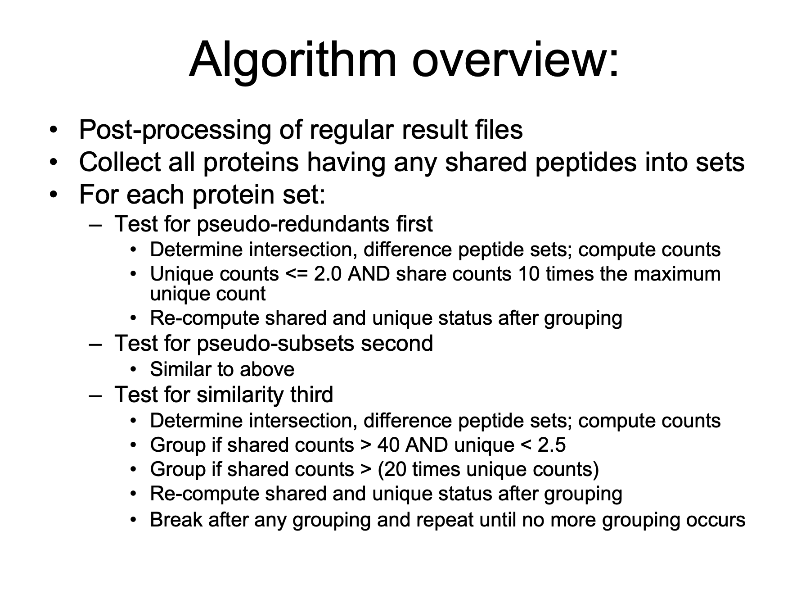

Here are some algorithm details a few of you will find interesting and most of you will not. The algorithm is implemented as a post-processing step in the processing pipeline I developed for OHSU. Proteins are collected into sets of proteins linked via any shared peptides. For each protein set, three rounds of testing are done. In analogy to regular peptide-to-protein mapping, pseudo-redundant proteins are grouped first. Then pseudo subsets are removed. The standard parsimony rules catch situations like identical twins. The pseudo definitions find non-identical twins. The last round of testing is for similar proteins. You can think of it as finding siblings, but not cousins.

---

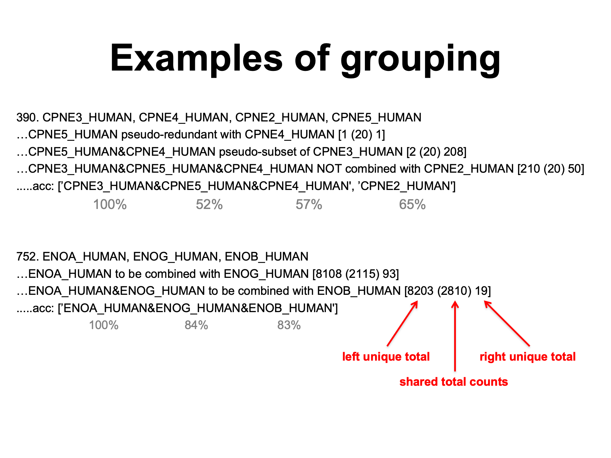

Here are a couple examples from data generated in collaboration with Justine Smith to illustrate the algorithm. This is some of the console output from the Python program. On top we have four Copine proteins that are linked by shared peptides. The first round of testing is for pseudo-redundant proteins and copine4 and copine5 are grouped. The numbers in the square brackets are the total unique counts for the first protein, the total shared counts in parentheses, and then the total unique counts for the second protein. The 20 shared counts are deemed large compared to the single unique counts. The next round of testing is for pseudo-subsets and the copine4/copine5 family is a pseudo-subset of copine3. Copine3 has a larger peptide set and the copine4/copine5 family is almost entirely contained in copine3’s peptide set. The final round of testing looks for cases where relative shared counts are large compared to the unique counts. In this case, the copine3 family does not overlap enough with copine2 to be grouped. Four proteins go in and one family and one protein come out. The numbers in grey are the percent identities between copine3 and the other copines. The bottom example is enolase proteins. Gamma enolase shares a very large number of peptides with alpha enolase and has a relatively small unique count, so it is grouped into an alpha enolase family. The situation is similar for beta enolase and it gets added to the alpha enolase family. Three proteins go in, one family comes out.

---

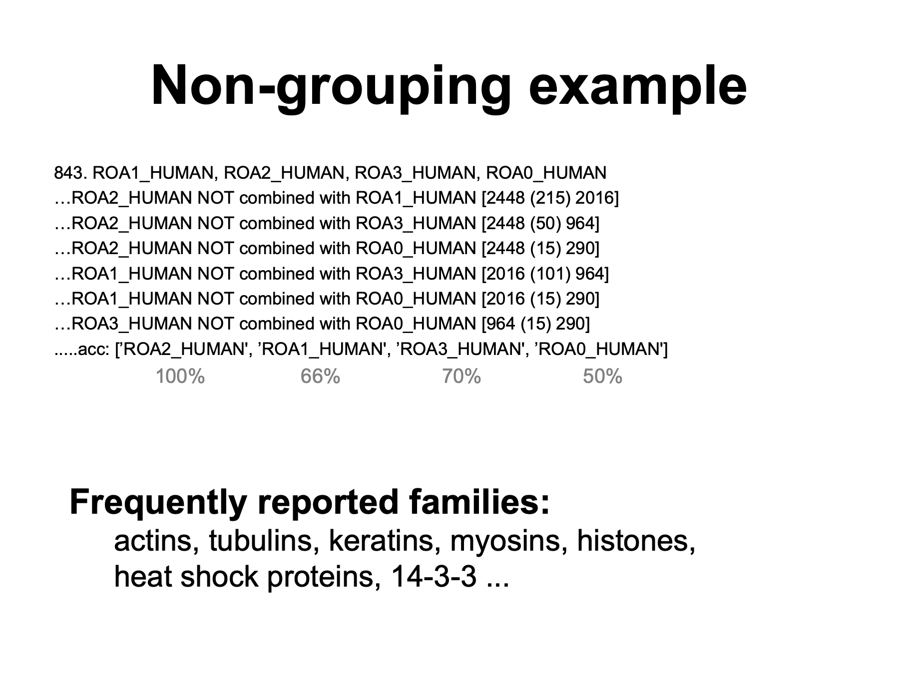

Here is a case where no grouping occurred. This is a set of ribonucleoproteins that have considerable identity to each other. However, the shared peptide counts are small relative to the unique peptide counts in all comparisons and there is no grouping. Four proteins go in, four proteins come out. We have run many samples through the algorithm since it was developed. We frequently see many obvious families such as actins, alpha tubulins, beta tubulins, various keratins, various myosins, various histones, heat shock proteins, and 14-3-3 proteins.

---

## Watch the algorithm in action

You can watch an example of the algorithm in action in [this video link](https://youtu.be/IAE59QrQYos). It is just over 2 minutes long. The data is from [this repository](https://github.com/pwilmart/MaxQuant_and_PAW/tree/master/PAW_results) and the `PAW_protein_grouper.log` file has all of the console output. The samples are from cultured mouse bone marrow cells.

---

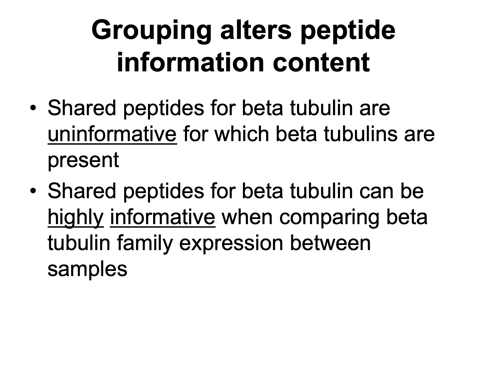

An important point is that grouping can dramatically alter peptide information content. For our example of beta tubulin, the shared peptides are pretty useless if we want to know which specific beta tubulin proteins are present in our sample. But what if we only wanted to compare total beta tubulin family expression between samples? Then all of the peptides shared between beta tubulins, but not mapped to any other proteins, are now highly informative for spectral counting, SILAC, iTRAQ, or MRM quantification, and do not need to be excluded. “Shared” has context and depends on the question being asked.

---

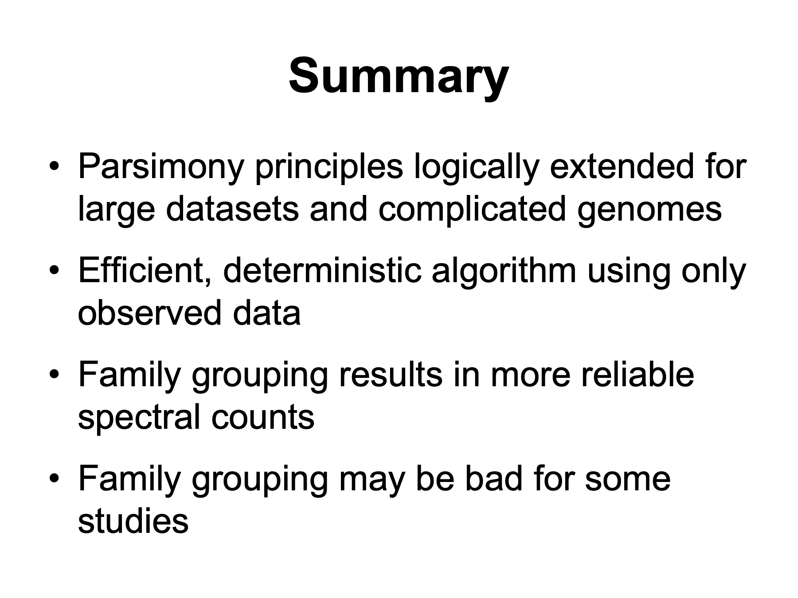

In summary, I have described logical extensions to parsimony principles that can handle the noise present in very large datasets, and also handle complicated genomes where peptide redundancy can be a significant challenge. The algorithm is fast, deterministic (which simplifies results), and uses only the observed peptide sequence information. Grouping into families and redefining shared and unique peptide status after grouping results in more reliable total spectral count estimates and more accurate quantitation. This is not necessarily a “one size fits all” solution. There can be questions such as alternative splicing where this would be the wrong thing to use.

---

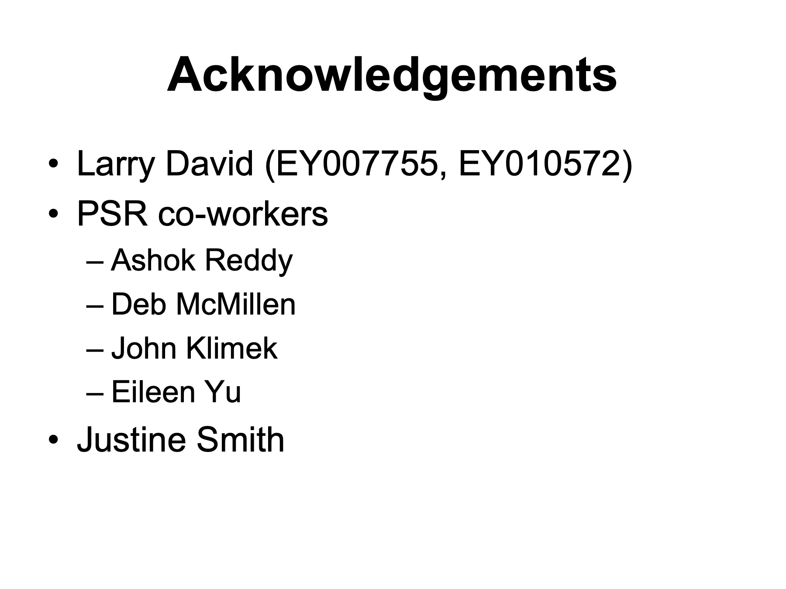

I would like to thank Dr. Larry David and our funding sources for support. I would like to acknowledge my PSR co-workers and thank Justine Smith for use of her data. And thanks to you for your attention this afternoon.

---

---
